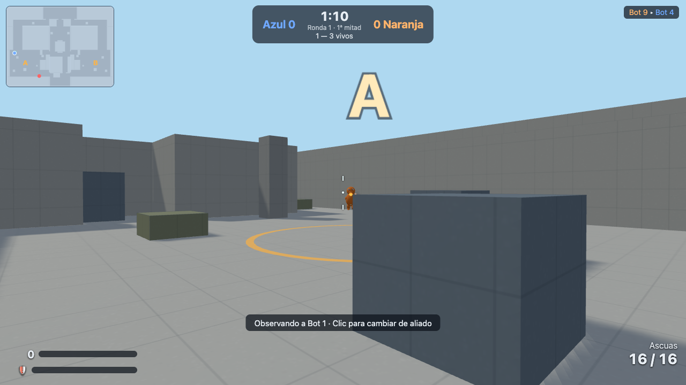

# Pokémon Tactical Arena

Fan game táctico **5 contra 5 por rondas** en el navegador, inspirado en la estructura táctica
de Counter-Strike: economía entre rondas, instalación/desactivación de un objetivo, información
por sonido y bots competentes. Los jugadores controlan directamente a Pikachu, Charmander,
Squirtle o Bulbasaur, que combaten con ataques de energía. **No oficial, sin ánimo de lucro**
(ver `ASSET_SOURCES.md` y Créditos en el juego).



## Requisitos

- Node.js ≥ 20 y npm (desarrollado con Node 20.19, npm 10.8).
- Navegador de escritorio con WebGL (Chrome/Firefox/Safari/Edge actuales).

## Arranque

```bash
npm install        # instala dependencias (lockfile incluido)
npm run dev        # desarrollo: cliente en http://localhost:5173 + servidor WS en :8080
# o producción:
npm run build      # compila cliente (Vite) y servidor (esbuild)
npm start          # sirve la compilación y el WebSocket desde el mismo origen: http://localhost:8080
```

Otros comandos: `npm test` (unitarias + integración), `npm run typecheck`, `npm run lint`.
Comprobaciones de navegador real (requieren `npm start` en marcha y Playwright):
`node tools/browser_check.mjs`, `node tools/browser_multi.mjs`, `node tools/browser_training.mjs`,
`node tools/browser_fullmatch.mjs`.

Puertos y variables: ver `.env.example` (`PORT`, `STATIC_DIR`). Sin secretos.

El **modo solitario y el entrenamiento funcionan sin servidor** (la simulación corre en un
Web Worker local): el cliente compilado puede alojarse estáticamente. El **multijugador**
necesita el servidor Node (`npm start`) porque usa WebSocket autoritativo.

## Cómo jugar

- **Jugar con bots**: tú y 9 bots (dificultad fácil/normal/difícil), partida completa.
- **Crear sala / Unirse**: salas privadas con código de 6 caracteres, hasta 10 humanos;
  las plazas vacías se rellenan con bots. El anfitrión inicia la partida.
- **Entrenamiento**: muñecos estáticos y móviles, compra libre, cambio de personaje y núcleo
  de práctica (instalar y desactivar tú mismo).

### Reglas

- Dos equipos (Azul y Naranja) de 5. Mitades de 6 rondas; al cambiar de mitad se intercambian
  los roles de ataque/defensa y se reinicia la economía. Gana el primero en llegar a **7**;
  un 6–6 es empate (sin prórroga).
- Fases: preparación 20 s (compra, puertas cerradas) → ronda 100 s → resolución 6 s.
- Los atacantes llevan un **núcleo energético** (lo porta el jugador marcado con ◆) y deben
  instalarlo en la zona A o B (mantener E 3 s, inmóvil). Instalado, sustituye el reloj por una
  cuenta atrás de 35 s; los defensores pueden desactivarlo (E durante 7 s, o 4 s con kit).
- 100 PV por ronda, sin regeneración. Escudo comprable (50 pt, absorbe el 50 % de cada impacto).
  Cabeza ×1,5. Sin fuego amigo, sin daño por caída, sin críticos aleatorios.
- Economía: inicio de mitad 800 cr; baja +200, instalación +200, desactivación +300; victoria
  +2400; derrota 1900 (+400 por derrota consecutiva, máx. +1200). Tope 6000 cr.
- Perfiles de ataque comunes a los cuatro personajes (mismo daño/cadencia/alcance; solo
  cambia la identidad elemental), con nombre de movimiento Pokémon por personaje:

  | Perfil | Pikachu | Charmander | Squirtle | Bulbasaur |
  | --- | --- | --- | --- | --- |
  | Pulso básico (gratis) | Impactrueno | Ascuas | Pistola Agua | Hoja Afilada |
  | Ráfaga táctica (1800) | Chispa | Lanzallamas | Rayo Burbuja | Bala Semilla |
  | Pulso preciso (2400) | Rayo | Llamarada | Hidrobomba | Rayo Solar |

  El orbe elemental ante la boca/manos indica el perfil equipado (visible también en los
  rivales): orbe sencillo = pulso, tres chispas orbitando = ráfaga, orbe con anillo = preciso.
  Habilidad Q (400), granada de niebla G (300), kit de desactivación (400, solo defensores).
- Habilidades: Pikachu *Destello* (ciega), Charmander *Ascua* (zona de daño), Squirtle
  *Cortina* (niebla), Bulbasaur *Esporas* (ralentiza).

### Controles (reasignables en Ajustes)

WASD mover · ratón mirar · clic izq. atacar · clic der. concentrar apuntado · Shift caminar ·
Ctrl agacharse · Espacio saltar · R recargar · Q habilidad · G granada · E interactuar/instalar/
desactivar · F soltar núcleo · B compra · Tab marcador · 1 ataque principal · Esc menú/ratón.
Ajustes disponibles: sensibilidad, invertir Y, FOV 75–105, volúmenes, calidad, resolución
interna 75 %, movimiento reducido y destello accesible (persisten en el navegador).

## Estructura

```
apps/client     cliente (Three.js + Vite): render, entrada, HUD, audio, predicción, worker local
apps/server     servidor Node (ws): salas, validación, bucle autoritativo 60 Hz
packages/shared reglas, movimiento, colisiones, mapa, bots, protocolo (una sola simulación)
tools           comprobaciones de navegador real y empaquetado
docs            arquitectura, diseño, controles y capturas
```

Detalles técnicos en `docs/ARQUITECTURA.md`; decisiones de diseño en `docs/DISENO.md`;
resultado de pruebas en `TEST_REPORT.md`.

## Limitaciones conocidas

- Un solo mapa («Estación Aurora») y modo principal + entrenamiento; sin campaña, ranking,
  cuentas, chat ni soporte móvil/mando (fuera de alcance por diseño).
- Modelos y sonidos son estilizaciones procedurales generadas por código (sin Blender en el
  entorno de construcción); ver `ASSET_SOURCES.md`.
- El objetivo de 60 FPS a 1080p con GPU integrada es una aspiración medida solo en el entorno
  de desarrollo (ver TEST_REPORT.md); no se garantiza en todo hardware.

## Despliegue (Railway)

El repo incluye `railway.json`: un único servicio construye todo (`npm run build`) y arranca
`npm start`, que sirve el cliente compilado y el WebSocket desde el mismo origen en `$PORT`
(healthcheck en `/salud`). Al desplegar desde GitHub, usa **un solo servicio apuntando a la
raíz del repo** — no separes `apps/client` y `apps/server` en servicios distintos, porque el
cliente espera el WebSocket en su propio origen.

## Empaquetado reproducible

```bash
bash tools/package_zip.sh   # genera pokemon-tactical-arena.zip sin node_modules ni cachés
```

No despliegues públicamente sin autorización. Proyecto sin monetización.
